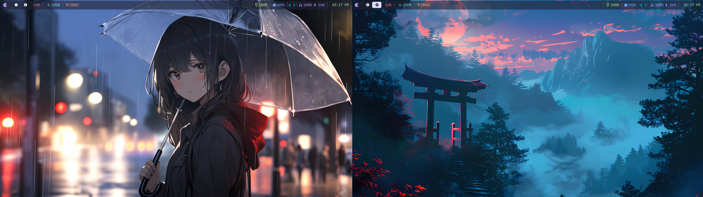
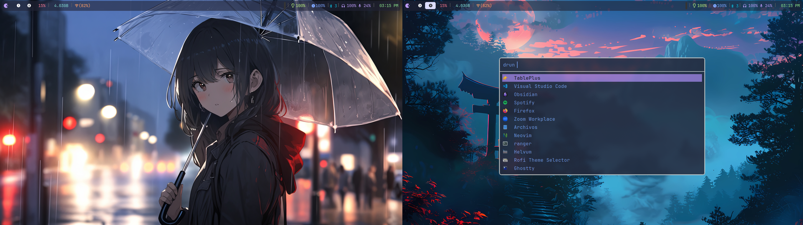
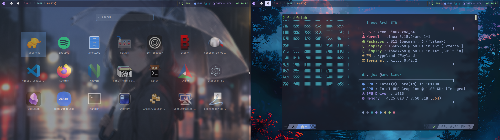

# Mis Dotfiles

Este repositorio contiene mis configuraciones personales (dotfiles) para diversas herramientas y entornos de desarrollo.

## Estructura del Repositorio

- `editors/`: Configuraciones para editores de texto (Neovim, VS Code).
- `gemini/`: Configuraciones y notas relacionadas con Gemini.
- `shell/`: Configuraciones de la shell (Zsh).
- `terminal/`: Configuraciones de terminal (Kitty).
- `tools/`: Configuraciones para herramientas diversas (Fastfetch, Rofi).
- `wallpapers/`: Colección de fondos de pantalla.
- `wm/`: Configuraciones para gestores de ventanas (Hyprland, Waybar).

## Instalación

Para instalar estas configuraciones, puedes ejecutar el script `install.sh`:

```bash
./install.sh
```

**Nota:** Este script está diseñado para mi entorno específico (Arch Linux). Es posible que necesites ajustarlo para tu sistema.

## Wallpapers

Aquí hay una vista previa de algunos de mis fondos de pantalla:

### Escritorio 1


### Escritorio 2


### Escritorio 3
