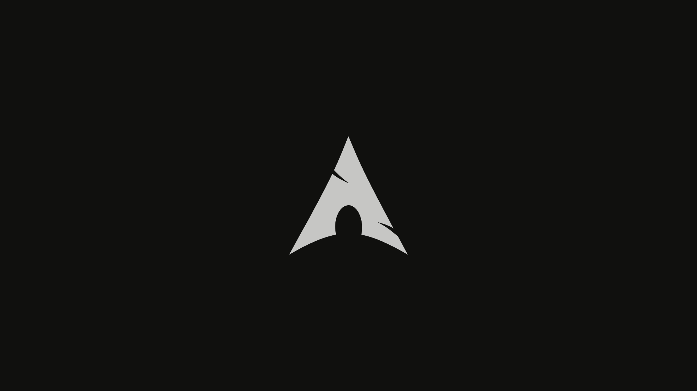

# Mis Dotfiles Personales


Un vistazo a mi rincón digital. Este repositorio contiene la configuración completa de mi entorno de desarrollo en Arch Linux, diseñado para ser minimalista, productivo y estéticamente agradable.

---

## Vista Previa


### Wallpaper 1


### Wallpaper 2


### Wallpaper 3


---

### Filosofía

-   **Minimalismo Funcional:** Solo lo esencial, sin sacrificar funcionalidad.
-   **Centrado en el Teclado:** Flujos de trabajo optimizados para no depender del ratón.
-   **Automatización:** Scripts y alias para acelerar tareas repetitivas.
-   **Estética Agradable:** Un entorno visualmente coherente y agradable a la vista.

---

### Características Principales

-   **Gestor de Ventanas:** Hyprland, con animaciones fluidas y una gestión de ventanas eficiente.
-   **Barra de Estado:** Waybar, altamente personalizable para mostrar información relevante del sistema.
-   **Lanzador de Aplicaciones:** Rofi, con menús personalizados para aplicaciones, emojis, portapapeles y más.
-   **Terminal:** Kitty, un emulador de terminal rápido y potente, acelerado por GPU.
-   **Editores de Código:**
    -   **Neovim:** Configuración basada en LazyVim, con autocompletado, linters y depuradores integrados.
    -   **Visual Studio Code:** Ajustes para una experiencia de desarrollo limpia y sin distracciones.
-   **Shell:** Zsh, con autocompletado, historial mejorado y un prompt minimalista.

### Estado actual (normal + portable)

- Instalador con selector de modo `normal` o `portable`.
- Modo `portable` con kernels `linux`, `linux-lts`, `linux-zen` (y headers).
- Deteccion dinamica de monitores y GPU en Hyprland.
- EWW multi-monitor en inicio de sesion.
- Servicios base habilitados (NetworkManager, Bluetooth; Tailscale en portable).
- GRUB portable con tema Crossgrub (ejecucion manual, no automatica).
- Paquetes clave incluidos: Zen Browser, Postman, Pear Desktop, Obsidian, btop, nvim.

---

### Estructura del Repositorio

```
/
├── shell/          # Configuracion de Zsh
├── terminal/       # Configuracion de Kitty
├── editors/        # Configuracion de Neovim y VSCode
├── gemini/         # Configuracion de IA (Gemini CLI)
├── wm/             # Configuracion de Hyprland, Waybar y Eww
├── portable/       # Perfil portable (paquetes, grub, scripts, perfiles)
├── tools/          # Configuracion de Rofi, Fastfetch y Opencode
├── wallpapers/     # Mi coleccion de fondos de pantalla
└── install.sh      # Script de instalacion automatizada
```

---

### Instalacion

**Advertencia:** Este script esta disenado para Arch Linux y modifica symlinks en `~/.config`.

1.  **Clona el repositorio:**

    ```bash
    git clone https://github.com/tu-usuario/mis-dotfiles.git
    cd mis-dotfiles
    ```

2.  **Ejecuta el script de instalacion:**

    ```bash
    ./install.sh
    ```

    Para reaplicar solo los symlinks y refrescar Hyprland/Waybar sin reinstalar paquetes:

    ```bash
    ./apply.sh
    ```

3. **Elige modo de instalacion cuando te lo pregunte:**

- `normal`: entorno diario (Hyprland, Waybar, EWW, apps y herramientas).
- `portable`: incluye `normal` + stack portable (`linux`, `linux-lts`, `linux-zen`, `grub`, `efibootmgr`, `btrfs-progs`, etc.).

El script se encargará de:

- Instalar y/o actualizar dependencias con `yay`.
- Crear enlaces simbolicos de configuracion en su ruta correcta (`~/.config/...`, `~/.zshrc`, `~/.gemini`).
- En modo `portable`, crear enlace adicional a `~/.local/share/mis-dotfiles-portable`.

Opciones utiles para pruebas seguras:

```bash
INSTALL_MODE=normal SKIP_PACKAGE_INSTALL=true ENABLE_SERVICES=false ./install.sh
INSTALL_MODE=portable SKIP_PACKAGE_INSTALL=true ENABLE_SERVICES=false ./install.sh
```

Con esto pruebas flujo y symlinks sin instalar paquetes.

Uso diario recomendado:

- Edita los archivos dentro de este repo; los symlinks hacen que `~/.config` y `~/.zshrc` apunten aqui.
- Cuando quieras reaplicar todo, corre `./apply.sh`.
- Si estas dentro de una sesion Hyprland, `./apply.sh` tambien lanza `hyprctl reload` y recarga Waybar.

### Portable (M.2)

En `portable/` esta la base para llevar Arch + Hyprland en disco externo:

- `portable/packages/`: manifiestos de paquetes (`pacman.txt`, `aur.txt`).
- `portable/scripts/`: setup base, cambio de perfil y verificacion de symlinks.
- `portable/bootloader/grub/`: plantilla de GRUB + instalacion portable + Crossgrub.

Para GRUB portable (manual y consciente):

```bash
cd portable/bootloader/grub
sudo ./install-portable-grub.sh /boot
```

Esto instala GRUB en modo `--removable` y aplica tema Crossgrub.

---

### Atajos de Teclado

La mayoría de los atajos de teclado están definidos en los siguientes archivos:

-   **Hyprland:** `wm/hyprland/bind.conf`
-   **Neovim:** `editors/nvim/lua/config/keymaps.lua`
-   **visual studio code:** `editors/vsc/keybindings.json`

---

Te recomiendo que los revises para familiarizarte con mi flujo de trabajo.

---

### Contribuciones

Aunque estos son mis dotfiles personales, estoy abierto a sugerencias y mejoras. Si tienes alguna idea, no dudes en abrir un *issue* o un *pull request*.

---

### Licencia

Este proyecto está bajo la licencia MIT.
